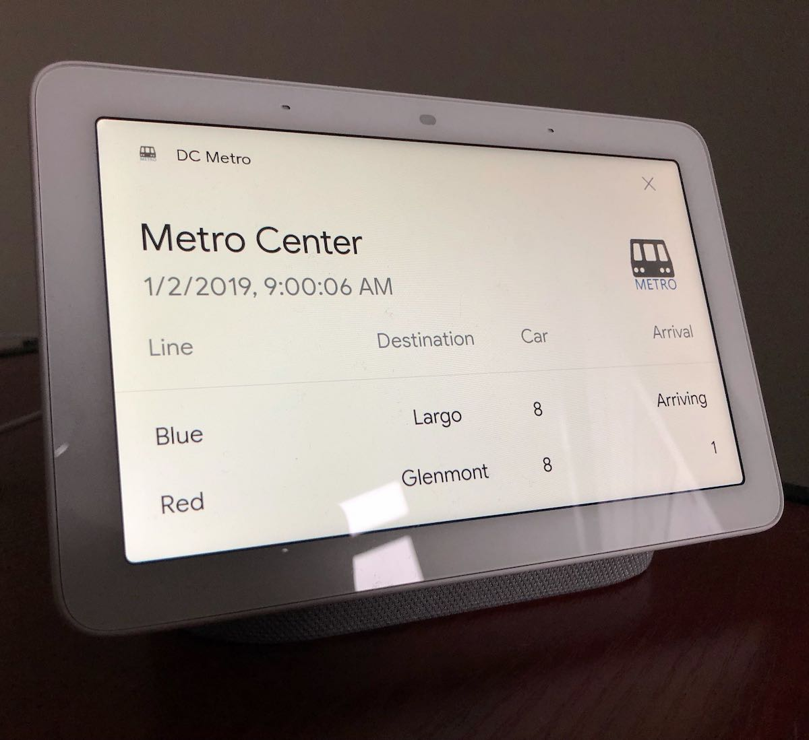

# DC Metro Google Assistant Action 🚉 🔉

This is a custom action for [Google Assistant](https://assistant.google.com/) which will tell you the current rail- and bus-predictions/incidents for the [DC Metro transit system](https://www.wmata.com/). These actions can be invoked on anything that supports Google Assistant such as a phone, a Google Home device, and the from the app. This action leverages the Metro API's. It's _not_ an official product provided by WMATA.

**You can view this application on the Google Assistant interaction directory [here](https://assistant.google.com/services/a/uid/000000c72972063a?hl=en-US) . [You can also check out the article I wrote on this here!](https://jamesiv.es/blog/dialogflow/2018/12/05/dc-metro-google-assistant-action)** 📡

## Installation Steps 💽
This application can be installed with Yarn by running `yarn install`. With the dependencies installed you can compile, lint, and format the code base using the following commands:

| Command | Description |
| ------------- | ------------- |
| `yarn format` | Formats the code. |
| `yarn lint` | Lints the code. |
| `yarn build` | Prepares the code for production. |
| `yarn test` | Runs the unit tests. All unit tests can be found within the [tests](functions/src/tests) directory. |

---

### Deploying the Action
This action uses [Firebase functions](https://firebase.google.com/docs/functions/) and [DialogFlow](https://dialogflow.com/). It can be deployed to [Firebase](https://firebase.google.com/) by running the `yarn deploy` command and by [importing the DialogFlow intents](https://dialogflow.com/docs/agents/export-import-restore) using the [zip file](DC-Metro.zip) found in the root of the repository. You'll also need to setup an environment variable within your functions configuration called `metro.apiKey` with an [API key from WMATA](https://developer.wmata.com/).

## Interactions 💬
You're able to invoke the action using Google Assistant by saying `Hey Google, talk to DC Metro`, or by using one of the following commands:

| Action | Description |
| ------------- | ------------- |
| `Ok Google, Ask DC Metro for the Train times at Farragut North`  | You can ask the action for a rail or train timetable at a specific station. For instance you can say `Rail times for Farragut North` or `Train times for U Street`. Stations with acronyms in their name will also work, for example `Metro times for George Mason University` will produce results even though the station name is GMU. |
| `Ok Google, Ask DC Metro for the Bus times for stop 3004076`  | You can ask the action for a bus stop timetable for a specific stop id. For instance you can say `Bus times for stop 123`. You can find the stop id on the sign that the bus stops at. |
| `Ok Google, Ask DC Metro for Train Commands`  | You can ask the action for a list of available commands by saying either `train commands` or `bus commands`.  |

If you have a screen the action will send a detailed timetable to your device.

The app icon used for the action was created by [Paganini](https://twitter.com/PaganiniArt).
